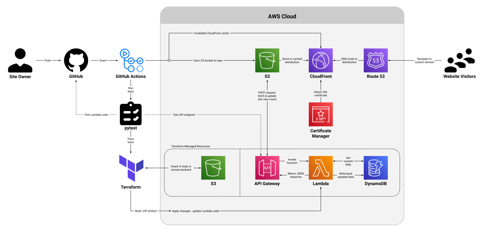

# cloud-resume-challenge

The [Cloud Resume Challenge](https://cloudresumechallenge.dev/docs/the-challenge/aws/) was created by [Forrest Brazeal](https://forrestbrazeal.com/) as a self-guided, hands-on project to incorporate a large range of skills used by DevOps Engineers and Cloud Developers.

The challenge is designed to champion *self-learning* as it intentionally gives only high-level guidance on how to research, navigate, and implement core topics such as DNS, APIs, Testing, Infrastructure-as-Code, and CI/CD pipelines.

 

My website is built on AWS using S3, CloudFront, Route 53, Certificate Manager, Lambda, DynamoDB, API Gateway, and the Boto3 Python SDK.

Infrastructure-as-Code is implemented using Terraform, while two CI/CD pipelines are triggered and executed using GitHub Actions.

 

View the site at [**william-lewis.com**](https://william-lewis.com).

Check out my article about completing the project here:  [**The Cloud Resume Challenge:  My DevOps Journey from Building Technology to the Cloud**](https://www.linkedin.com/pulse/cloud-resume-challenge-my-devops-journey-from-building-william-lewis)

 
 

---

## Challenge Steps & Notes:

- [x]  1. Earn an **AWS Certification**
    - passed Cloud Practitioner in September 2022, the Solutions Architect Associate in October 2022

- [x]  2. Write Resume in **HTML**
    - utilized Bootstrap framework for general organization & positioning
    - recreated a sample from scratch (instead of a downloaded template)

- [x]  3. Style Resume in **CSS**
    - used selective overrides on top of Bootstrap framework

- [x]  4. Deploy Resume to Static Website with **AWS S3**
    - utilized OAC (origin access control) to improve security by restricting access to CloudFront distribution
    - left public access blocked & static website feature disabled for compatibility with OAC

- [x]  5. Use HTTPS Protocol with **AWS CloudFront**
    - redirects any HTTP requests to HTTPS
    - IPv6 enabled in addition to IPv4
    - SSL certificate validated for root domain and `*.` subdomains

- [x]  6. Point Custom DNS Domain Name with **AWS Route 53**
    - custom domain purchased through **Cloudflare** (not Route 53)
    - validation CNAME records needed in Cloudflare DNS settings
    - CNAME / A / AAAA alias records not needed in Route 53 for successful DNS resolution
    - website successfully loads from multiple browsers, with & without `www.` subdomain

- [x]  7. Create a Webpage Visitor Counter with **Javascript**
    - POST request sent to Lambda funcion using Fetch API
    - latest number of page views displayed to visitor at page bottom

- [x]  8. Create a Visitor Counter Database with **AWS DynamoDB**
    - noSQL database holds single record with single attribute which is updated by Lambda function

- [x]  9. Connect Webpage to Database with **AWS API Gateway + Lambda**
    - REST API exposes URL endpoint, allowing for GET and POST requests
    - API call invokes Lambda function, relaying function return value as API response to website

- [x] 10. Write a Lambda Function with **Python + AWS Boto3 SDK**
    - Boto3 SDK manages DynamoDB table, retrieving and updating value of view count record
    - function checks latest count from table, increments +1, and persists new value back to table
    - function returns JSON response to API, to deliver JSON resposne back to website
    - `requirements.txt` file used to track module dependencies and versions for project

- [x] 11. Perform **Tests** on Python Code
    - tests run on pytest framework, with lambda function imported locally to be tested
    - moto package used to mock DynamoDB resources
    - os module used to pass environmental variables to utilize mock resources
    - requests module used to make calls to API URL endpoint 

- [x] 12. Configure Resources with **IaC Using Terraform**
    - Terraform used to automatically provision and configure AWS Lambda, DynamoDB, API Gateway
    - S3 bucket also provisioned to act as remote Terraform backend by hosting tf.state file
    - Lambda Python code uploaded as .zip file artifact using `archive_file` data source
    - CORS enabled using [api-gateway-enable-cors](https://registry.terraform.io/modules/squidfunk/api-gateway-enable-cors/aws/latest) module by [Martin Donath]((https://github.com/squidfunk/terraform-aws-api-gateway-enable-cors))

- [x] 13. Utilize **Source Control** with GitHub
    - all code related to website stored in a GitHub repository
    - version control utilized to track changes and capture development over time
    - `.gitignore` file used to avoid committing binary / superfluous files (e.g. .terraform and pycache directories) to remote repo

- [x] 14. Implement **Backend CI/CD** for Terraform with GitHub Actions
    - event trigger defined when specific .py lambda function file is pushed to main branch
    - workflow runs on GitHub-hosted Linux runner
    - Python dependencies installed on runner per `requirements.txt` file using pip
    - GitHub Actions configured as trusted identity provider with AWS, utilizing OpenID Connect token-based authentication for short-lived credentials
    - ARN of GitHub Actions IAM Role passed into workflow file as an environmental variable using GitHub repository secrets
    - unit tests run on new Lambda code, then Terraform changes applied, and finally integration test run on API endpoint

- [x] 15. Implement **Frontend CI/CD** for Webpage Content with GitHub Actions
    - event trigger defined when any frontend files are included in a push to main branch
    - S3 bucket is synchronized to GitHub repo to contain latest .HTML, .CSS, and .JS files
    - Cache of CloudFront distribution is invalidated (cleared) to ensure latest frontend content is immediately available to website visitors

- [x] 16. Share Your Challenges and Learnings with a **Blog Post**
    - article published on LinkedIn

